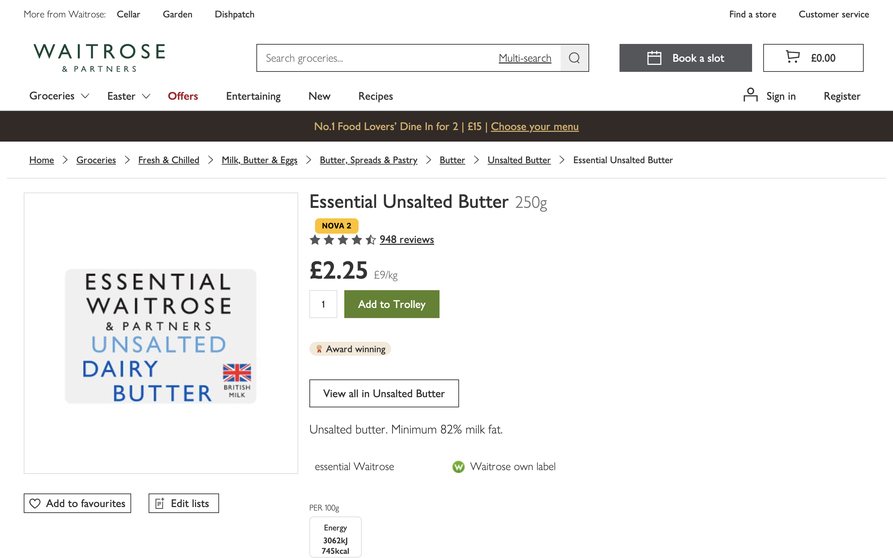
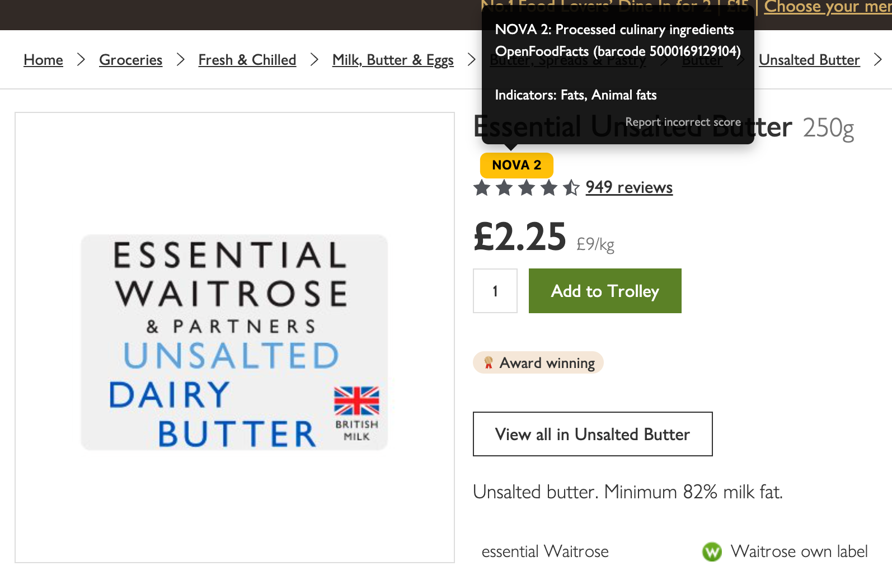
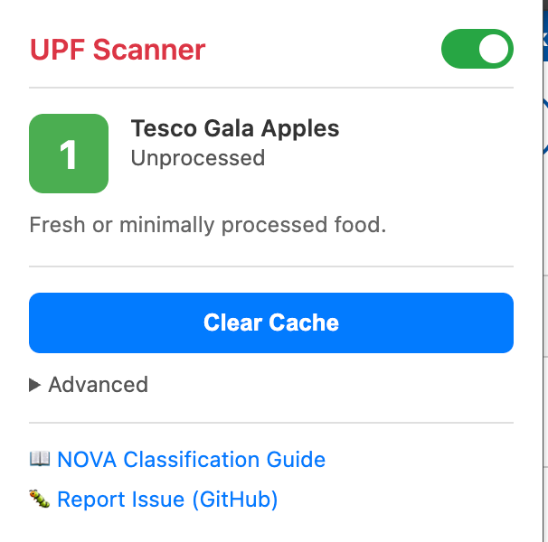
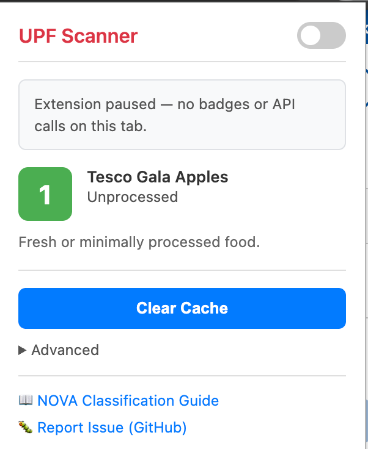

# UPF Scanner – Spot Ultra-Processed Food


**Identify ultra-processed foods while shopping online**

A Chrome extension that automatically displays NOVA classification ratings on UK supermarket websites, helping you make healthier food choices.

Supported sites: 

- Tesco
- Sainsbury's
- Asda
- Morrisons
- Waitrose
- Ocado

---

## What is NOVA?

**NOVA** is a food classification system that categorizes foods based on their level of processing:

- **NOVA 1** 🟢 - Unprocessed or minimally processed (fresh fruits, vegetables, meat)
- **NOVA 2** 🟡 - Processed culinary ingredients (salt, sugar, butter, oils)
- **NOVA 3** 🟠 - Processed foods (canned vegetables, cheese, bread)
- **NOVA 4** 🔴 - Ultra-processed foods (soft drinks, instant noodles, ready meals, packaged snacks)

Research links ultra-processed foods (NOVA 4) to [increased risk of obesity, heart disease, diabetes, and other health issues](https://pubmed.ncbi.nlm.nih.gov/38418082/). The term "UPF" was popularised in the UK by Prof. Chris van Tulleken's book [*Ultra-Processed People*](https://www.amazon.co.uk/Ultra-Processed-People-Stuff-That-Isnt/dp/1529900050) (2023).

For a deeper dive, see the BBC documentary [*Irresistible: Why We Can't Stop Eating*](https://www.bbc.co.uk/iplayer/episode/m0025gqs/irresistible-why-we-cant-stop-eating) and the [NOVA classification guide on Open Food Facts](https://world.openfoodfacts.org/nova).

---

## Features

- **Automatic Detection** - Scans products on supermarket pages and shows NOVA ratings
- **Color-Coded Badges** - Easily spot ultra-processed foods (red badges)
- **Detailed Info** - Hover over badge to see why a product is classified as NOVA 4
- **Fast & Non-Intrusive** - Doesn't slow down your shopping experience
- **Hybrid Classification** - Uses OpenFoodFacts database + ingredient analysis for maximum coverage
- **Privacy-Focused** — No tracking, no data collection, works offline with cache. Defaults to off in incognito; pause anytime from the popup.
- **Privacy Controls** — Toggle the extension off from the popup at any time; it defaults to paused in incognito mode, with a one-tap session opt-in

---

## Installation

### Chrome Web Store (Recommended)

*Coming soon — submission in progress.*

### Load Unpacked (Developers)

1. **Clone or download this repository**
   ```bash
   git clone https://github.com/MikeCain21/upf-scanner.git
   cd upf-scanner
   ```

2. **Open Chrome Extensions page**
   - Navigate to `chrome://extensions/`
   - Enable "Developer mode" (toggle in top-right corner)

3. **Load the extension**
   - Click "Load unpacked"
   - Select the `upf-scanner` folder
   - Extension should appear in the list

4. **Start shopping!**
   - Visit [Tesco Groceries](https://www.tesco.com/groceries/)
   - NOVA badges will appear on products automatically

---

## Usage

### On Product Detail Pages

When viewing an individual product, the badge appears with the product information.



### Hover for Details

Hover over any badge to see:
- The **NOVA category name** (e.g. "Processed culinary ingredients")
- The **data source** — barcode lookup via OpenFoodFacts or local ingredient analysis
- **Which indicators** triggered the classification (e.g. "Fats, Animal fats")
- A **"Report incorrect score"** link

### Click to Open Food Facts

When a product is identified via its barcode, clicking the badge opens its full Open Food Facts page where you can find:
- Full ingredient list
- Nutri-Score
- Additives and their risk levels
- Allergens
- Eco-score and environmental impact
- Detailed nutrient breakdown per 100g
- Product photos contributed by the community

Example tooltip:
```
NOVA 2: Processed culinary ingredients
OpenFoodFacts (barcode 5000169129104)

Indicators: Fats, Animal fats
Report incorrect score
```




### Toolbar Badge

When you visit a supported product page, the extension icon in your Chrome toolbar updates to show the product's NOVA rating at a glance — no need to open the popup.

| NOVA 1 | NOVA 2 | NOVA 3 | NOVA 4 |
|--------|--------|--------|--------|
|  |  |  |  |

### Extension Popup

Click the extension icon on any supported product page to see:
- The product's NOVA score with name and classification label
- Why it was classified (NOVA 4 indicator ingredients, if applicable)
- A link to the product on Open Food Facts
- Enable/disable toggle to pause all badges and API calls
- Settings (clear cache, toggle debug mode)
- Links to the NOVA Classification Guide and GitHub issue tracker

| Enabled | Disabled |
|---------|----------|
|  |  |

---

## How It Works

1. **Product Detection** - Identifies products on supermarket pages
2. **Barcode Extraction** - Attempts to extract EAN/UPC barcode from the page
3. **OpenFoodFacts Lookup** - Checks if product exists in OpenFoodFacts database
4. **Fallback Classification** - If not found, analyzes ingredients for ultra-processed indicators
5. **Badge Display** - Shows color-coded NOVA rating inline with product

### Ultra-Processed Indicators (NOVA 4)

The extension looks for:
- **E-numbers** (food additives): E621 (MSG), E951 (aspartame), E407 (carrageenan), etc.
- **Modified starches**: Modified corn starch, modified tapioca starch
- **Protein isolates**: Soy protein isolate, whey protein isolate
- **Industrial sweeteners**: High-fructose corn syrup, maltodextrin
- **Emulsifiers and stabilizers**: E471, E412, mono- and diglycerides
- **Other processing markers**: Hydrolyzed proteins, reconstituted ingredients

---

## Supported Supermarkets

| Supermarket | Status | Notes |
|-------------|--------|-------|
| **Tesco** | ✅ Supported | Product detail pages (PDPs) |
| **Sainsbury's** | ✅ Supported | Product detail pages (PDPs) |
| **Asda** | ✅ Supported | Product detail pages (PDPs) |
| **Morrisons** | ✅ Supported | Product detail pages (PDPs) |
| **Waitrose** | ✅ Supported | Product detail pages (PDPs) |
| **Ocado** | ✅ Supported | Product detail pages (PDPs) |

---

## FAQ

### Is this extension free?
Yes, completely free and open source (MIT licence).

### Does it track my data?
No. The extension only stores product classifications in your local browser cache. No personal data is collected or sent anywhere.

### How does it use OpenFoodFacts?
When you view a product page, the extension looks up that specific product in the [OpenFoodFacts](https://world.openfoodfacts.org/) database using its barcode — one request per product, triggered by your browsing. It does not bulk-download product data or crawl any supermarket websites. OpenFoodFacts data is used under the [Open Database Licence (ODbL)](https://opendatacommons.org/licenses/odbl/).

### What if a product isn't classified?
Some products may not have ingredients listed or may be missing from OpenFoodFacts. In these cases, the badge will show "?" or be skipped.

### Why does a product show NOVA 1 even though it seems processed?

If the product page has no ingredient list (loose produce, some bakery items), the extension
defaults to NOVA 1 — a conservative choice to avoid false positives for genuinely unprocessed
items like fresh fruit. If you believe the product is processed, check whether the ingredient
list is visible on the page and use the **Report incorrect score** link in the tooltip.

### What if the classification seems wrong?
NOVA classification can be nuanced. If you believe a classification is incorrect:
1. Check the tooltip to see which ingredients triggered the classification
2. Use the **Report incorrect score** link in the tooltip to submit a report
3. Refer to [OpenFoodFacts](https://world.openfoodfacts.org/) for official data

### Does it work offline?
Yes! Once a product is classified, it's cached for 7 days. You can browse offline and still see cached ratings.

### Will this slow down my browsing?
No. The extension is optimised for performance:
- Caches results to minimise API calls
- Processes products in the background
- Doesn't block page rendering

---

## Development

### For Contributors

See [CONTRIBUTING.md](CONTRIBUTING.md) for full contribution guidelines.

**Documentation:**
- `CLAUDE.md` - Development guide (AI-assisted workflow)
- `docs/DECISIONS.md` - Architecture decision records
- `docs/API.md` - OpenFoodFacts API integration details
- `docs/CLASSIFICATION_LOGIC.md` - NOVA classification rules

**Project Structure:**
```
upf-scanner/
├── manifest.json              # Chrome extension manifest
├── background/                # Service worker (API calls, caching)
├── content/                   # Content scripts (injected into pages)
│   ├── sites/                 # Site-specific adapters (tesco.js, sainsburys.js, …)
│   └── ui/                    # Badge rendering and styles
├── lib/                       # Shared libraries (classifier, parser)
├── popup/                     # Extension popup UI
├── test/                      # Jest unit tests
└── docs/                      # Developer documentation
```

**Running Tests:**
```bash
npm test                  # All unit tests (395 tests)
npm run test:watch        # Watch mode
npm run test:coverage     # Tests + per-file coverage report
npm run lint              # ESLint
npm run format            # Prettier (auto-format source files)
```

### Technology Stack
- **JavaScript (ES6+)** - Main language
- **Chrome Extension Manifest V3** - Extension framework
- **OpenFoodFacts API v3** - Product/NOVA data source
- **chrome.storage.local** - Caching layer

---

## Roadmap

### v1.2.1 (Current)
- ✅ Tesco, Sainsbury's, Asda, Morrisons, Waitrose, Ocado support
- ✅ NOVA 1–4 classification
- ✅ OpenFoodFacts v3 barcode lookup + stateless ingredient analysis
- ✅ Rule-based local classifier (NOVA 2 culinary + NOVA 3 processing markers)
- ✅ Inline colour-coded badges with tooltip and "Report incorrect score" link
- ✅ Popup: stats, clear cache, debug toggle

### v1.3 - Enhanced Accuracy
- Improved ingredient parsing
- User corrections fed back to OpenFoodFacts

### v2.0 - Advanced Features
- Basket analysis (% ultra-processed in cart)
- Healthier alternative suggestions
- Nutritional scoring (Nutri-Score)

---

## Contributing

Contributions welcome! See [CONTRIBUTING.md](CONTRIBUTING.md) for details.

---

## License

**MIT License** — see [LICENSE](LICENSE) for full text.

Copyright (c) 2026 UPF Scanner Contributors

---

## Acknowledgments

- **[OpenFoodFacts](https://world.openfoodfacts.org/)** — Free, open product database. Data used under the [Open Database Licence (ODbL)](https://opendatacommons.org/licenses/odbl/). Factual data is © OpenFoodFacts contributors.
- **NOVA Classification** — Developed by researchers at the University of São Paulo, Brazil (Monteiro et al.)
- **Contributors** — Thank you to all who help improve this extension

---

## Disclaimer

This extension is for **informational purposes only**. NOVA classifications are based on available ingredient data and may not be 100% accurate. The extension reads ingredient and barcode data from product pages you visit — it does not bulk-scrape supermarket sites or make requests beyond the product you are currently viewing. Always read product labels and consult healthcare professionals for dietary advice.

---

**Made with ❤️ for healthier eating**
